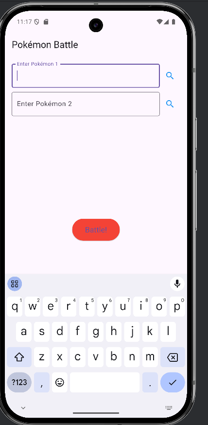

# lab5
The Pokemon app looks like;

In this flutter project  a users can allows for two Pokemon cards using the 
Pokemon TCG API and battle them based on their HP values. So Here, app fetches 
the two Pokemon cards, displays their images and HP and declares a winner based
on which Pokemon has teh highest HP.

Features
1. Search for Pokemon by name.
2. Fetch two random Pokemon cards using the Pokemon TCG API.
3. battle Logic: Compare the HP values and declares a winner.
4. Error handling for invalid Pokemon name.
5. User friendly UI with responsive layout.

Here I have install dependencies in the pubspec.yaml.

**Code Explanation**
1. main() Function - The entry point of the Flutter application. It initializes the PokemonBattleApp
and runs it using runApp().
2. PokemonBattleApp- The root widget of the application.
3. Uses MaterialApp to define the app's theme and home screen (PokemonBattleScreen).
4. PokemonBattleScreen (Stateful Widget)-This is the main screen where users interact with the app.
It includes:
- State Variables:searchController1 & searchController2: Text controllers for Pokémon search fields.
- pokemon1 & pokemon2: Store details of the selected Pokémon.
- battleResult: Stores the battle outcome.

Functions:
fetchPokemon(String name, int player)
Fetches Pokémon details from the Pokémon TCG API.
Stores the retrieved Pokémon's data in pokemon1 or pokemon2.
Shows an error if the Pokémon is not found.

- battlePokemons() works as ;
Compares the HP of both Pokémon.
Determines and displays the winner or a tie if HP is equal.
Shows an error if either Pokémon is missing. showError(String message)
Displays an error message using a SnackBar.

- build() Method:
Defines the UI of the application, including:
Two text fields for Pokémon name input.
Search buttons to fetch Pokémon details.
Pokémon cards displaying name, HP, and image.
A "Battle" button to initiate the comparison.
A text widget to display the battle result.

- buildPokemonCard(Map<String, dynamic> pokemon)
Creates a widget to display Pokémon details, including:
Pokémon image
Pokémon name
Pokémon HP

 Here, the app works when the  user enters the two Pokemon name in te search field 
and clicks the search button to fetch their details. Then, click battle button to compare thier HP. 
So after clicking teh battle button the highest HP is declared the winner.

This project is a starting point for a Flutter application.

A few resources to get you started if this is your first Flutter project:

- [Lab: Write your first Flutter app](https://docs.flutter.dev/get-started/codelab)
- [Cookbook: Useful Flutter samples](https://docs.flutter.dev/cookbook)

For help getting started with Flutter development, view the
[online documentation](https://docs.flutter.dev/), which offers tutorials,
samples, guidance on mobile development, and a full API reference.
